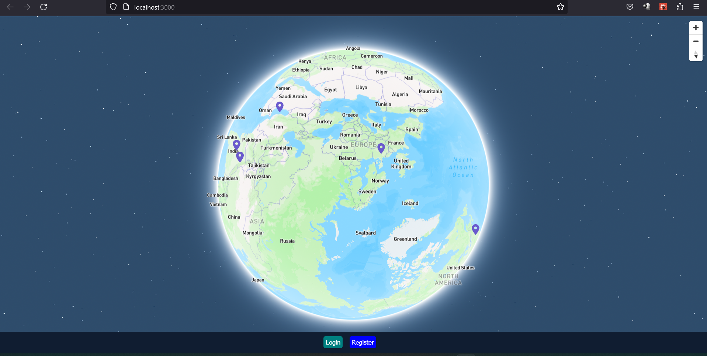
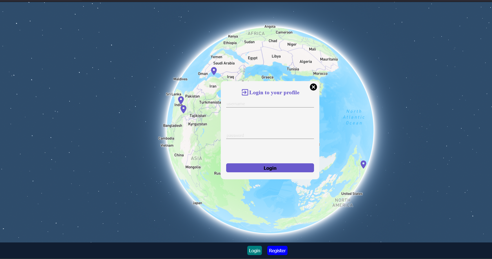
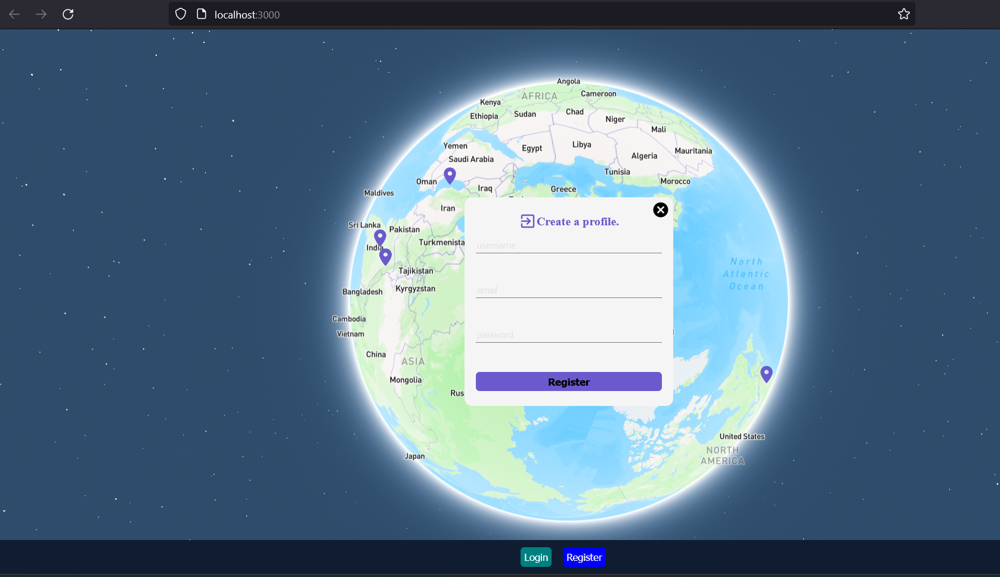
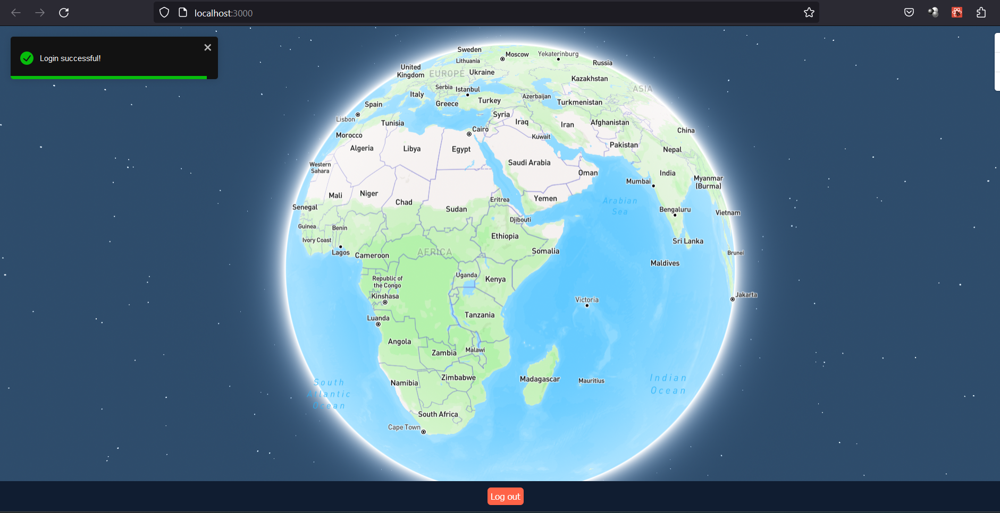
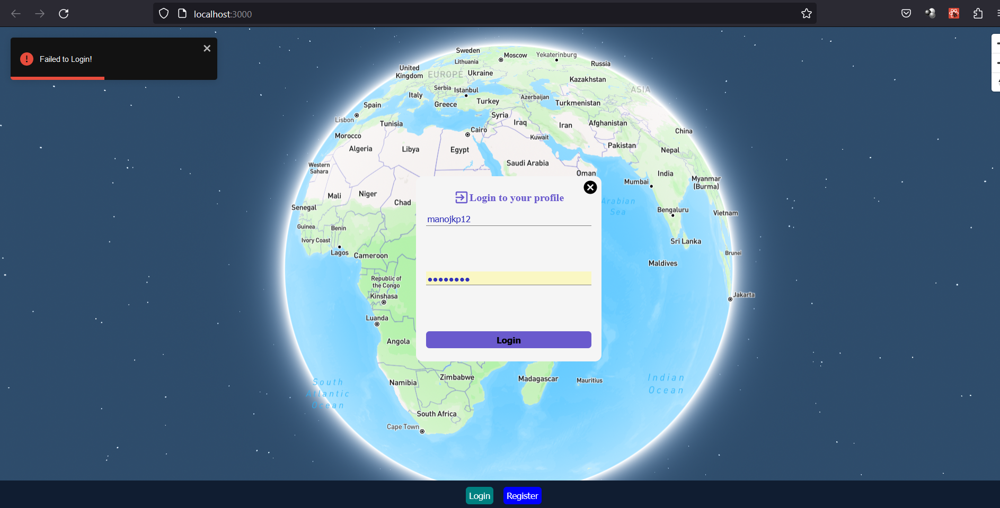

<h1>Travel App</h1>
<h4>Description</h4>

Travel App is a web application that allows users to pin their favorite travel destinations on a world map, rate them, review them, and share them with other users. Users can browse through the map to find interesting locations, and create a pin to add their own favorite places. 

<h4>Tech Stack</h4>
    
Backend: Node.js, Express.js, REST API

    
Frontend: React.js, JavaScript, Mapbox GL JS, react-map-gl

    
Backend: NoSQL (MongoDB), Mongoose (ODM)

<h4>Features</h4>

    <ul>
        <li> User registration </li>
        <li> 3D Projection of Globe with interactive pins </li>
        <li> Pin creation, rating, and review functionality </li>
        <li>User profile page</li>
        <ul>Social sharing features</ul>
    </ul>

<h4>How to Use</h4>

<ul>
    <li>Clone the repository or download the source code</li>
    <li>Navigate to the root directory of the project in your terminal</li>
    <li>Install the required dependencies by running npm install</li>
    <li>Set up environment variables by creating a .env file in the root directory and adding the necessary variables</li>
    <li>Start the server by running npm start or node index.js</li>
    <li>Navigate to the client directory by running cd client </li>
    <li>Install the frontend dependencies by running npm install</li>
    <li>Open your browser and navigate to http://localhost:3000</li>
    <li>Register a new account or log in with an existing account</li>
    <li>Browse the world map/ Globe and find interesting locations</li>
    <li>Click on the map to create a pin and rate/review the location</li>
    <li>See your pinned locations</li>
    <li>Share your favorite travel destinations with friends and family</li>
</ul>
    
<h1>API Documentation</h1>

The Travel App uses a RESTful API to communicate between the frontend and backend. Here is the documentation for the available endpoints:

<h4>Application ScreenShorts</h4>
</h5>Home page</h5>
    
    
 </h5>Home page</h5>
    
    
 </h5>Home page</h5>
    
    
    
  </h5>Home page</h5>
    
    
    
   </h5>Home page</h5>
    

<h4>API Endpoints</h4>

The Travel App uses the following endpoints to communicate between the frontend and backend:

<h4>Pins<h4>

GET "/"

  <strong>Retrieves all pins</strong>

POST "/" 

  <strong>Creates a new pin</strong>
<h4>Users</h4>
    
POST "/registration"

<strong>Creates a new user account</strong>

GET "/login" 

    <strong>Logs in an existing user</strong>
<h4>API URL</h4>

Here is the URL for API interaction: "proxy": "http://localhost:7800/api"

<h4>Credits</h4>
<ul>
  <li>Mapbox for the interactive map</li>
  <li>react-map-gl for the React bindings for Mapbox GL JS</li>
  <li>bcryptjs for password hashing</li>
  <li> MongoDB for the database management</li>
</ul>
    
   
   
  

