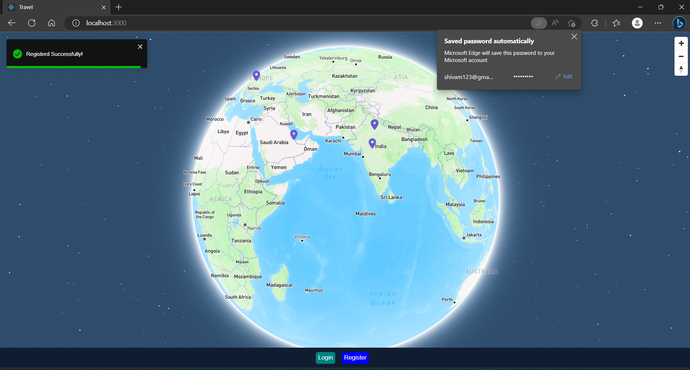
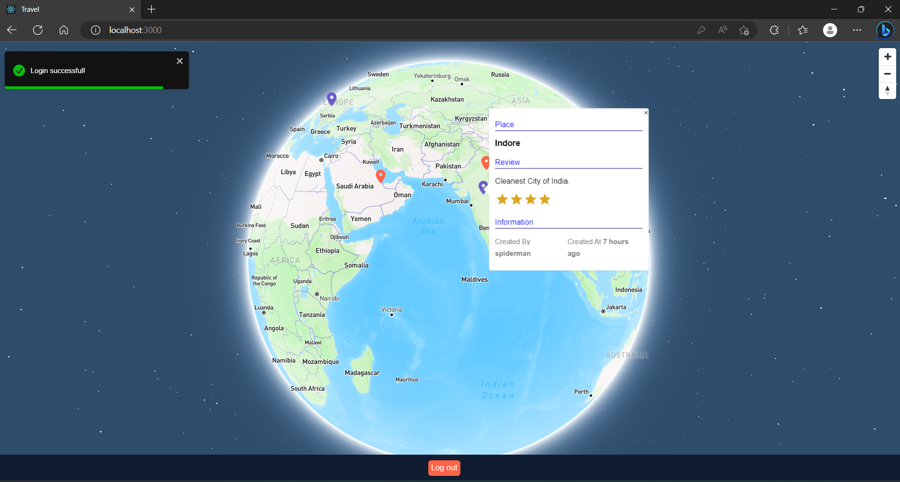
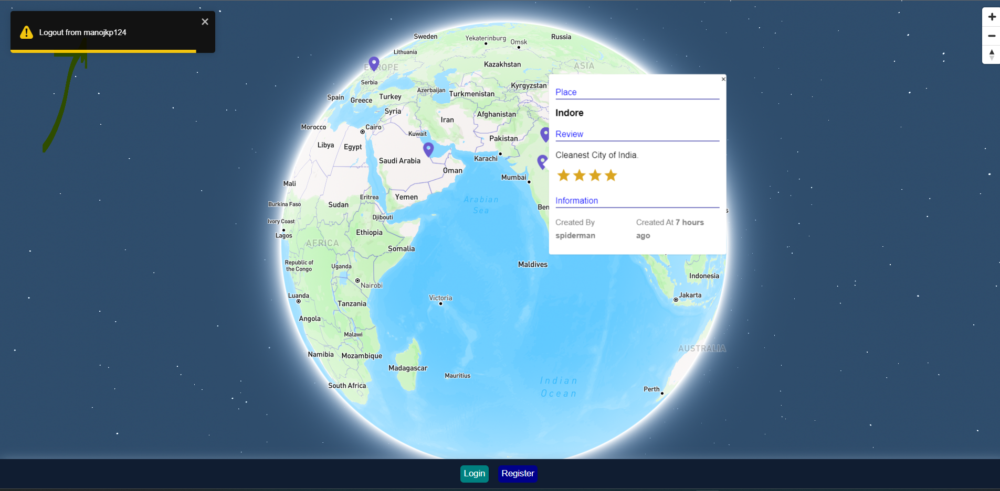

# WanderMarker: Leave Your Mark on the Map

## Description

Travel App is a web application that allows users to pin their favorite travel destinations on a world map, rate them, review them, and share them with other users. Users can browse through the map to find interesting locations and create a pin to add their favorite places.

## Tech Stack

- **Backend**: Node.js, Express.js, REST API
- **Frontend**: React.js, JavaScript, Mapbox GL JS, react-map-gl
- **Database**: NoSQL (MongoDB), Mongoose (ODM)

## Features

- User registration
- 3D Projection of Globe with interactive pins
- Pin creation, rating, and review functionality
- Double tap to location and create a pin
- User profile page
- Social sharing features

## How to Use

1. Clone the repository or download the source code.
2. Navigate to the root directory of the project in your terminal.
3. Install the required dependencies by running `npm install`.
4. Set up environment variables by creating a `.env` file in the root directory and adding the necessary variables.
5. Start the server by running `npm start` or `node index.js`.
6. Navigate to the client directory by running `cd client`.
7. Install the frontend dependencies by running `npm install`.
8. Open your browser and navigate to `http://localhost:3000`.
9. Register a new account or log in with an existing account.
10. Browse the world map/globe and find interesting locations.
11. Click on the map to create a pin and rate/review the location.
12. See your pinned locations.

# API Documentation

The Travel App uses a RESTful API to communicate between the frontend and backend. Here is the documentation for the available endpoints:

## API Endpoints

### Pins

- **GET "/":** Retrieves all pins.
- **POST "/":** Creates a new pin.

### Users

- **POST "/registration":** Creates a new user account.
- **GET "/login":** Logs in an existing user.

## API URL

Here is the URL for API interaction: `"proxy": "http://localhost:7800/api"`.

# Application Screenshots

## Home

## Login

## Register

## Register Success

## Login Success

## Validation Message

## Review

## Logout

# Credits

- Mapbox for the interactive map
- react-map-gl for the React bindings for Mapbox GL JS
- bcryptjs for password hashing
- MongoDB for the database management
